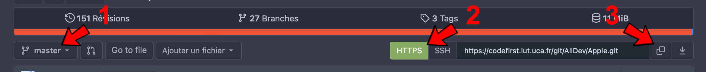
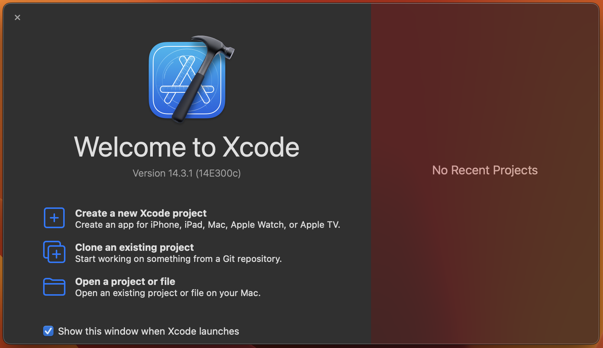
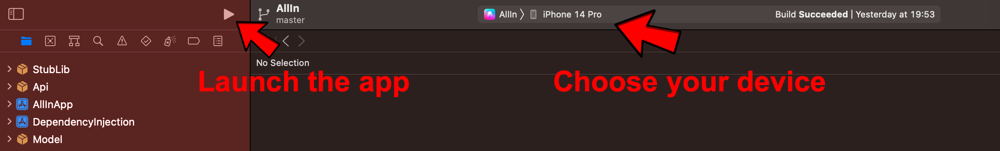

  
    
---

&nbsp; 
&nbsp; 

---

[Présentation](#apple---all-in) | [Répartition du dépôt](#répartition-du-gitlab) | [Structures](#structures) | [Technologies](#technologies) | [Outils](#outils) | [Wiki](https://codefirst.iut.uca.fr/git/AllDev/Gestion_de_projet/wiki)

### Apple - ALL IN!

**Contexte** : Application Swift et SwiftUI pour le projet universitaire de troisième année (B.U.T Informatique de Clermont-Ferrand) intitulé *All In*.
 

**Description** : Ce dépôt contient l'ensemble du code pour la partie client iOS de l'application *ALL IN*.
 

# Répartition du dépot

[**Sources**](Sources) : **Code de l'application**

[**Documentation**](Documentation) : **Documentation de l'application**

# Structures

- MVVM

# Fonctionnement

- ### Comment lancer le projet ? 

:information_source: *Assurez-vous d'avoir un Mac à disposition*

Tout d'abord si ce n'est pas fait cloner le dépôt de la branche **master/main**, pour cela copier le lien URL du dépôt git :

Sur votre Mac, ouvrez l'IDE **Xcode** (disponible via l'App Store), puis cloner le dépôt en utilisant l'URL copiée précédemment  :

Vous serez alors redirigé par l'IDE et pourrez lancer l'application sur l'appareil de votre choix :

*Si vous souhaitez lancer l'application sur votre appareil personnel, il sera nécessaire de renseigner votre compte iCloud dans l'IDE !*

# Technologies

Pour réaliser l'interface visuelle, nous avons opté pour **SwiftUI** du fait qu'elle permet de réaliser des interfaces utilisateurs complexes de manière élégante. Le framework est récent, mis à jour régulièrement, et facile à prendre en main pour le développement.

# Outils

Pour la partie API, nous avons utilisé plusieurs outils :

- UserDefaults

Pour stocker le token localement, nous utilisons l'outil fourni par SwiftUI qui est UserDefaults, afin de réaliser une authentification automatique lorsque le client ouvre l'application, en récupérant son token lors de la précédente connexion.

© AllDev - Apple

